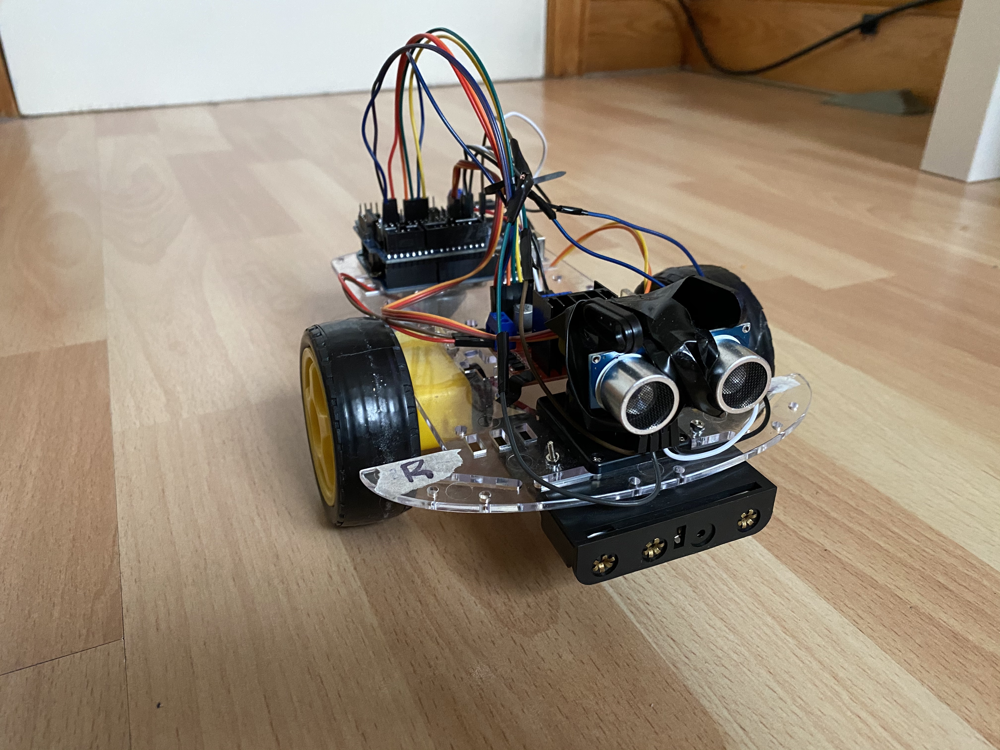

# Obstacle avoidance Arduino controlled car
 Using a pre-built [Arduino kit](https://www.ebay.co.uk/itm/Smart-Car-Smart-Robot-Car-Chassis-Kit-Tracking-Motor-2WD-Ultrasonic-Arduino-MCU/274068571943?ssPageName=STRK%3AMEBIDX%3AIT&_trksid=p2057872.m2749.l2649d) I connected the parts (including some additionaly bought) and wrote C++ code using the Arduino IDE to move the car whilst avoiding any objects in its path.

# Current state
 Hardware https://img.shields.io/staticv1?label=<LABEL>&message=<95%>&color=<GREEN>
 Software https://img.shields.io/static/v1?label=<LABEL>&message=<100%>&color=<BRIGHTGREEN>	

# Visuals

# Libraries, hardware, etc.
Here is a list of some of the code libraries that I used:

* [Servo.h](https://www.arduino.cc/reference/en/libraries/servo/)

The hardware:

* [The full kit](https://www.ebay.co.uk/itm/Smart-Car-Smart-Robot-Car-Chassis-Kit-Tracking-Motor-2WD-Ultrasonic-Arduino-MCU/274068571943?ssPageName=STRK%3AMEBIDX%3AIT&_trksid=p2057872.m2749.l2649)

	**That includes:**
	1. 2 x DC Motors
	2. 1 x Acrylic Robot Chasis
	3. 2 x 2.51” Rubber Wheels
	4. 1 x AA Battery Holder

	**Main sensors:**
	1. 1 x HC-SR04 Ultrasonic Sensor
	2. 1 x Servo Motor (SG90)
	3. 1 x Arduino Uno
	4. 1 x L298N Dual H-Bridge Motor Driver 
	5. 1 x Arduino Sensor Shield v.5

# Roadmap and project status
Some planned work for the future includes:

* improving the power suply distribution from the power source (4 x AA batteries) to the Sensor Shield v.5
* adding a LCD Display Screen Module to display messages
* adding a Bluetooth Serial Wireless Module
* developing an Android App to control the servos using the Bluetooth Serial Wireless Module
